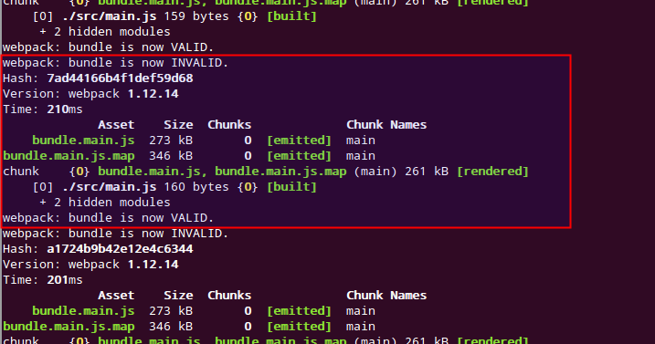

# 001-simple

## How to "require" existed npm modules

### 1. Create a npm package
```shell
npm init
#======== [CONSOLE OUTPUT] ========
    ... ...
    name: (001-simple) thinkbase.net-webpack-steps-001
    version: (1.0.0)
    description: webpack-steps-001-simple
    entry point: (index.js)
    test command:
    git repository: https://github.com/thinkbase/dev-thinkbase.net
    keywords:
    author: thinkbase.net
    license: (ISC) Apache-2.0
    About to write to /***/dev-thinkbase.net/.research/webpack-steps/001-simple/package.json:

    {
      "name": "thinkbase.net-webpack-steps-001",
      "version": "1.0.0",
      "description": "webpack-steps-001-simple",
      "main": "index.js",
      "directories": {
        "doc": "docs"
      },
      "scripts": {
        "test": "echo \"Error: no test specified\" && exit 1"
      },
      "repository": {
        "type": "git",
        "url": "git+https://github.com/thinkbase/dev-thinkbase.net.git"
      },
      "author": "thinkbase.net",
      "license": "Apache-2.0",
      "bugs": {
        "url": "https://github.com/thinkbase/dev-thinkbase.net/issues"
      },
      "homepage": "https://github.com/thinkbase/dev-thinkbase.net#readme"
    }


    Is this ok? (yes)
```

### 2. Prepare webpack
```shell
# install webpack as devDependency
npm install webpack --save-dev
... ...
# install webpack-dev-server as devDependency
npm install webpack-dev-server --save-dev
... ...
# installation copy the commands into .bin  folder
ls node_modules/.bin -al
#======== [CONSOLE OUTPUT] ========
总用量 8
drwxrwxr-x   2 zzj zzj 4096  3月 26 02:08 .
drwxrwxr-x 188 zzj zzj 4096  3月 26 02:08 ..
lrwxrwxrwx   1 zzj zzj   15  3月 26 02:04 errno -> ../errno/cli.js
lrwxrwxrwx   1 zzj zzj   25  3月 26 02:04 esparse -> ../esprima/bin/esparse.js
lrwxrwxrwx   1 zzj zzj   28  3月 26 02:04 esvalidate -> ../esprima/bin/esvalidate.js
lrwxrwxrwx   1 zzj zzj   19  3月 26 02:04 json5 -> ../json5/lib/cli.js
lrwxrwxrwx   1 zzj zzj   14  3月 26 02:08 mime -> ../mime/cli.js
lrwxrwxrwx   1 zzj zzj   20  3月 26 02:04 mkdirp -> ../mkdirp/bin/cmd.js
lrwxrwxrwx   1 zzj zzj   16  3月 26 02:04 sha.js -> ../sha.js/bin.js
lrwxrwxrwx   1 zzj zzj   25  3月 26 02:04 uglifyjs -> ../uglify-js/bin/uglifyjs
lrwxrwxrwx   1 zzj zzj   21  3月 26 02:08 uuid -> ../node-uuid/bin/uuid
lrwxrwxrwx   1 zzj zzj   25  3月 26 02:04 webpack -> ../webpack/bin/webpack.js
lrwxrwxrwx   1 zzj zzj   47  3月 26 02:08 webpack-dev-server -> ../webpack-dev-server/bin/webpack-dev-server.js
```

### 3. Install dependencies
```
# install jquery as dependency
npm install jquery --save
... ...
# install date-format as dependency
npm install date-format --save
... ...
```

### 4. Create webpack config file
See [`../webpack.config.js`](../webpack.config.js)

### 5. Create html and js, then build
See [`../src/main.js`](../src/main.js) and [`../src/test/test.html`](../test/test.html)

```shell
# run webpack to build bundle javascript file
webpack
# run webpack-dev-server to start the hot-swap http server
webpack-dev-server
```

After run `webpack-dev-server`, the test code should be accessed by http://localhost:8080/src/test/test.html, and, if `main.js` changed, `webpack-dev-server` should process hot-swap:


### END
